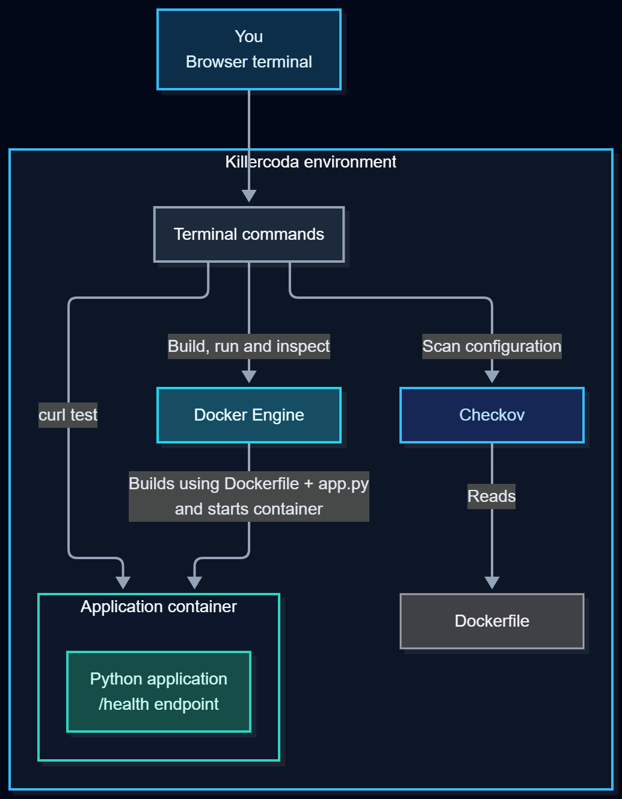

# Container Security with Checkov

In this tutorial, you will find and fix security misconfigurations in a Dockerfile. You will use Checkov for static analysis and Docker to verify the result at runtime.

## Prerequisites

You should be comfortable running terminal commands and know that a Dockerfile describes how an image is built. Basic familiarity with instructions such as `FROM`, `RUN`, `COPY`, `USER` and `CMD` is helpful. The fix step explains the security-related changes, so advanced Docker knowledge is not required.

The starter Dockerfile has three problems:

- The application runs as root.
- The base image uses the mutable `latest` tag.
- The image has no health check.

This is a focused exercise that runs three selected Checkov policies. It is not a complete container security assessment.

## DevOps relevance

This tutorial connects infrastructure as code, automated feedback, and runtime verification. Tracking the Dockerfile in Git allows teammates to review configuration changes before they are merged. Adding Checkov automates part of that review and finds potential security issues, such as a missing non-root user.

Not every finding is a direct security vulnerability: the mutable tag affects reproducibility, while the missing health check affects reliability and failure detection.

Running these checks after each change helps catch problems early. In a CI pipeline, a failed check can stop a change from progressing toward deployment until the problem is addressed.

## Learning outcomes

After the tutorial, you should be able to:

1. Scan a Dockerfile with Checkov and understand its findings.
2. Explain why root containers, mutable image tags and missing health checks can cause problems.
3. Fix the Dockerfile and confirm that the selected checks pass.
4. Compare static scan results with the behavior of a running container.
5. Explain what a static scan can and cannot prove.

The workflow is:

```text
scan -> investigate -> fix -> rescan -> rebuild -> verify
```

The environment is temporary. The intentionally insecure container is only used inside this tutorial.

## Architecture and workflow overview



Checkov reads the Dockerfile without building or running it. Docker uses the Dockerfile and `app.py` to build an image, then starts a container from that image. The Python application exposes an HTTP endpoint (`/health`) on port 8000. After a `HEALTHCHECK` instruction is added, Docker periodically runs it inside the container and records whether the application responded successfully.

### Design decisions

- **Checkov for static checks:** Checkov is free, provides named policies with clear findings, and can run locally or in CI across several infrastructure-as-code formats. Hadolint focuses specifically on Dockerfile linting, while tools such as Trivy also cover broader vulnerability scanning. We use Checkov here to keep the tutorial focused on configuration policies. We selected three checks to connect each finding to a concrete change.
- **Small Python application:** We use a simple Python application to keep setup simple and focus on container configuration. The same Python runtime performs the health check, so no extra tool is needed.
- **Non-root user:** This application does not need root privileges. Restricting its permissions follows the basic security principle of least privilege.
- **Explicit base-image version:** A version tag makes the intended runtime clearer than `latest`. Tags can still change, so a digest is more appropriate when exact image immutability is required.
- **An HTTP health check:** A running process may still fail to serve requests. Checking an endpoint gives Docker an application-level signal, although it only covers the behaviour tested by that endpoint.
